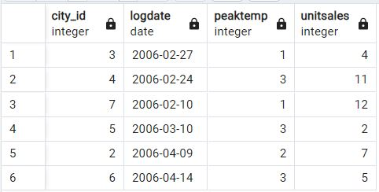
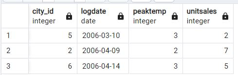
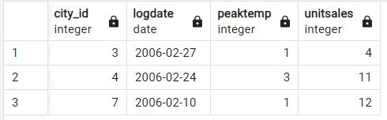

В данной лабораторной работе необходимо было выполнить партиционирование с использованием Postgres.
Выполненные скрипты и запросы указаны в файле query.sql.
Результат запроса SELECT * FROM measurement:

Результат отделения февральских данных от общих:

Результат запроса SELECT * FROM measurement_y2006m02 (партиция с данными за февраль)

